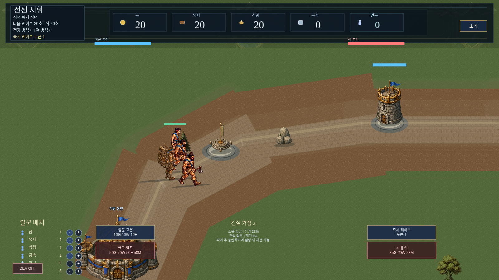
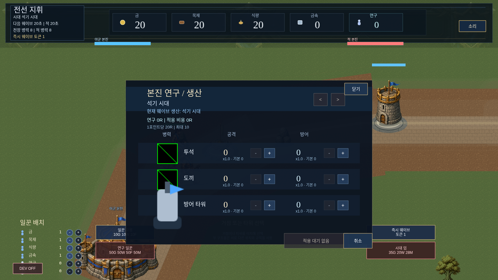

# UX/UI + Codebase Architecture Review (2026-08-08)

Requested by the user: a "is this usable as a web game" pass — explicitly
**not** a fun/gameplay judgment, but a review of feature placement,
information layout, font sizing, and general polish, plus a separate pass
on source-code organization (file/function placement, refactor and
modularization candidates). This document only records findings; nothing
in this document was implemented — see the summary table at the end for
suggested next steps and priority.

Screenshots referenced below are real captures from the live `:5173` dev
build (Playwright, 1600×900 viewport, no browser scaling) saved under
`artifacts/ux-architecture-review/`.

## Part 1 — UX/UI Review

### 1.1 Confirmed bug: DEV OFF button overlaps the worker panel



`LaneBattleHudView.ts:249` places the dev-mode toggle button at
`(42, 846)` with height 34 (spans y≈829-863). The worker-allocation rows
start at `y=738` and step by 25px per role
(`gold, wood, food, metal, research, idle` — `LaneBattleHudView.ts:228-231`),
putting `research` at y≈838 and `idle` at y≈863. **The DEV OFF button is
unconditionally created (`devToggleButton` has no visibility gate) and
sits directly on top of the 연구/유휴 rows** — in the screenshot the
"연구" row's `+`/`-` buttons are half-covered and the "유휴" row is
completely hidden behind the button. This isn't a dev-only artifact; a
normal player sees this on every match. This is the single highest-priority
fix in this document — it's a real interaction bug, not a polish nit.

### 1.2 Worker panel: permanent HUD real estate vs. "enter the base" screen

The user's specific question: should worker assignment move into a
dedicated base-management screen instead of always occupying bottom-left
HUD space?

Findings:
- Clicking the main base already opens a modal (`BaseResearchPanel`,
  screenshot below) titled "본진 연구 / 생산" — a natural home for worker
  assignment already exists and is already the "enter the base" screen the
  user is describing. Right now it only handles research point allocation;
  worker assignment lives in a completely separate, always-visible panel.
- The worker panel is used *continuously* during play (reallocating as the
  economy's needs shift, especially now that the AI does this
  automatically — see the AI economy work from the previous session) —
  unlike research, which is a slower, more occasional decision. There's a
  real tradeoff here, not just an the "obviously better" placement the
  question phrasing implies:
  - **Moving it into the base panel** reduces HUD clutter and groups all
    "base management" decisions in one place, matching the user's
    instinct. Cost: worker reallocation becomes a multi-click, modal-open
    action instead of a always-visible one, which will feel slower for a
    knob players may want to touch every 20-30 seconds.
  - **Keeping a compact version on the HUD** (e.g. shrink to icon-only
    rows with the detail — labels, cost impact — moved into a hover
    tooltip or the base panel) preserves fast access while cutting the
    permanent screen footprint.
  - Recommendation: given how frequently worker reallocation matters
    (every wave cycle), keep quick access on the HUD but move the
    **full/detailed** view (with the "what does this worker produce"
    explanation from 1.3) into the base panel, and compress the HUD
    version to just icon + count + +/-. This also directly fixes 1.1 by
    freeing vertical space.

### 1.3 No explanation of what an additional worker actually does

Confirmed: `createWorkerRow()` (`LaneBattleHudView.ts:268-278`) renders
only an icon, a role label (`getWorkerRoleLabel`), a count, and +/- — no
tooltip, no "+1 gold/tick" style text anywhere in the HUD or the base
panel. The underlying rate absolutely exists in code
(`tickResourceWorker` in `laneEconomy.ts`: 1 resource unit per assigned
worker every `BASE_RESOURCE_TICK_SEC` = 5s, or `RESEARCH_RESOURCE_TICK_SEC`
= 10s for research) — it's just never surfaced to the player. A first-time
player has no way to know whether reassigning a worker is worth it, or by
how much. This is a real information gap, not a nice-to-have: it's the
central economic decision of the game and it's explained nowhere in the
UI.

Suggested minimal fix: a static caption under the worker panel title
("각 일꾼은 5초마다 자원 1을 생산 (연구는 10초)") plus, ideally, a small
"+1/5초" style suffix per row — no new systems needed, this is pure text.

### 1.4 Resource icons exist — but aren't reused for costs

The top resource bar already uses icons (금/목재/식량/금속/연구, each with
a small glyph next to the number — visible in every screenshot). But every
cost display in the game (`일꾼 고용 10G 10W 10F`, `연구 일꾼 50G 50W 50F
50M`, `시대 업 35G 20W 28M`, tower rebuild cost, building costs) uses the
`G`/`W`/`F`/`M` letter-suffix format instead, via `formatCostShort()`
(`LaneBattleScene.ts`). This is exactly the inconsistency the user flagged.
The icons for gold/wood/food/metal/research already exist as loaded
textures (used in the top bar) — reusing them in a small icon+number
sequence for every cost line (replacing `formatCostShort`'s string
concatenation with a row of small icon+number pairs) is achievable without
new art, and would fix the top-bar/cost-display inconsistency at the same
time it makes costs faster to scan (icons are recognized faster than
reading a letter code, especially for players who haven't memorized which
letter maps to which resource — `W`≈wood but also could misread as
"war"/"wealth" at a glance, whereas the wood icon is unambiguous).

### 1.5 Broken/placeholder icons in the base research panel



The 투석/도끼 rows in `본진 연구 / 생산` render Phaser's default
green/black diagonal-checker **missing-texture placeholder**, not real
unit portraits. `BaseResearchPanel.ts:203` creates the row icon with
`resolveTeamUnitTextureKey("stone-axeman-w-idle", "player")` as a
placeholder default, and `updateRows()` (`:95-98`) swaps in
`row.iconTextureKey` per row — for at least the stone-age rows shown here,
whatever key is being resolved isn't a texture that's actually loaded.
This reads as a broken/unfinished panel to any player who opens it, which
undermines the "본진" screen being a good home for more UI (1.2) until
it's fixed.

### 1.6 Base panel doesn't block interaction with what's behind it

In the same screenshot, the worker panel and its buttons (일꾼 고용, 연구
일꾼) remain fully visible and — per the object graph — still interactive
underneath/beside the modal, since the panel is drawn as a centered box
rather than a full-screen overlay with an input-blocking backdrop. A
player can currently click "일꾼 고용" while the base research panel is
open. Not confirmed to cause a hard bug (the hire logic doesn't care what
panel is open), but it's inconsistent modal behavior and worth a dimmed
full-screen backdrop with input capture, standard for any modal.

### 1.7 Font sizing under `Phaser.Scale.FIT`

The game canvas is fixed at 1600×900 and scaled to fit the browser
viewport (`Phaser.Scale.FIT`, `main.ts`). Every HUD text size is a literal
pixel value in that 1600×900 space:

| Element | Size |
| --- | --- |
| Panel title ("전선 지휘") | 24px |
| Age/wave/base-count/token lines | 13px |
| Resource bar numbers | 33px (30px for research) |
| "일꾼 배치" section title | 20px |
| Worker role label / count | 13px |
| Capture/tower panel title | 17px |
| Capture/tower panel body | **11px** |
| Info line, base labels | **11px** |

On a 1600×900 or larger display this is fine. On a smaller laptop window
or a tablet-width browser, `FIT` scales the whole canvas down
proportionally — an 11px string can end up rendering under 8px, which is
not reliably legible. There's no responsive floor. This matters
specifically because the user asked about "usable as a web game": web
players resize windows and use a wide range of screen sizes far more than
a fixed-resolution native build would need to handle. Recommendation: at
minimum, audit and bump the two 11px sizes (capture/tower panel body,
info/base labels) — they carry real gameplay information (owner, HP,
rebuild cost), not decoration.

### 1.8 Smaller observations

- The 일꾼 배치 panel and the strategic action buttons (고용/연구/즉시
  웨이브/시대업) sit in the same lower band as the roster-summary text
  that was hidden earlier this session — that band is now visually
  sparser than before, which is a good opportunity to use the freed space
  for 1.3's explanation text rather than leaving it empty.
- 시대 업/연구 일꾼 cost text and the age-up button share the same visual
  "red when unaffordable" treatment now (fixed this session) — worth
  double-checking the *capture point build buttons* (타워/병참/조달소) get
  the same treatment; they weren't in scope for the affordability-styling
  fix and should be checked for consistency.

## Part 2 — Codebase Architecture Review

### 2.1 The core finding: `LaneBattleScene.ts` is a 4,300-line, 177-method god object

```
wc -l src/scenes/LaneBattleScene.ts   → 4303 lines
grep -c "private \|public "            → 177 methods/fields
```

For comparison, the next-largest file in the project is `backend.ts` at
1,200 lines (audio synthesis — itself large, but single-responsibility).
Everything about a single lane-siege match currently lives in one
`Phaser.Scene` subclass: movement/targeting, melee/ranged combat, capture
points, defense towers, the AI (economy + building + tower decisions),
wave spawning, unit presentation/animation sync, projectile VFX, damage
application, HUD glue, research application, and debug/verification
snapshot generation.

This isn't a new problem introduced this session, and the project already
demonstrates the right pattern elsewhere — `systems/lane-economy/`,
`systems/lane-capture/`, `systems/lane-combat/`, `presentation/units/` all
hold extracted, independently testable logic that the scene calls into.
The god-object problem is that a large fraction of the domain logic
*never made it out* of the scene file and still lives inline as private
methods, while the scene also has to own all the Phaser-specific
object-creation and per-frame sync work that legitimately can't move.

### 2.2 Responsibility clusters found in `LaneBattleScene.ts`

Grouped from the full method inventory (177 entries), with the file's
current line count as a proxy for how much could realistically move out:

| Cluster | Representative methods | Est. scope | Extraction target |
| --- | --- | --- | --- |
| Movement/targeting/combat resolution | `advanceUnit`, `tickCombat`, `findCombatSlot`, `isCombatSlotFree`, `repositionTowardCombat`, `tryShiftLane`, `isLaneRowFree`, `findNearestEnemy(Tower)`, `unitDistance`, `towerDistance`, `forwardTowerBlockLimit`, `keepUnitInPlayableLane` (~20 methods) | large | `systems/lane-combat/` already exists for timing/attack profiles; movement/targeting could join it as e.g. `unitMovement.ts`, taking scene state (units, towers, lanes) as plain arguments the way `aiEconomy.ts` does |
| Capture points + defense towers (tick/select/build/visuals) | `tickCapturePoints`, `tickWatchtower`, `tickTowerRuinControl`, `tickSupplyDepot`, `tickMint`, `tickCapturePointTower`, `selectCapturePoint`, `selectDefenseTower`, `tryBuildAtSelectedPoint`, `tryDismantleSelectedPoint`, `tryRebuildSelectedDefenseTower`, `resolveCapturedStructure`, `refreshCapturePointVisuals`, `refreshDefenseTowerVisuals`, `getDefenseTowerVisualState`, `initializeCaptureBuildingState`, `resetCaptureBuildingState` (~19 methods) | large | `systems/lane-capture/` already holds the rules (`captureRules.ts`, `defenseTowerRules.ts`) — this cluster is the natural next piece: a `captureController.ts`/`towerController.ts` that owns tick+select+build, called from the scene |
| AI decisions (scattered) | `tickAi`, `tickAiEconomy`, `shouldAiAgeUp`, `hasAffordableUnbuiltAiCapturePoint`, plus `enemyAutoBuildCapturePoint`/`enemyAutoRebuildDefenseTower` living inside the capture-point cluster above | medium | Everything "what does the enemy decide" reads better as one `aiController.ts` composing `aiEconomy.ts` + capture/tower decisions, instead of being interleaved with the player-facing capture-point code that happens to also serve the AI |
| Projectiles / damage application / rewards | `launchProjectile`, `getUnitProjectileAnchor`, `getTowerProjectileAnchor`, `getCapturePointProjectileAnchor`, `applyDamageToUnit`, `applyDamageToTower`, `killUnit`, `rollKillResourceReward`, `applyKillResourceReward`, `playImpactFeedback`, `checkBasePressure`, `tryAttackBase` (~12 methods) | medium | Distinct enough from movement/targeting to be its own module (`combatResolution.ts` or similar) even though it's Phaser-object-heavy (VFX) |
| Unit presentation/animation sync | `syncUnitPresentation`, `syncUnitVisual`, `destroyUnitPresentation`, `setUnitPresentationVisible`, `refreshUnitOverlayDensity`, `shouldShowV2UnitLabel`, `styleUnitNameplate`, `styleV2WorldText`, `progressToScreen`, `getGroundDepth`, `cssPxToWorld`, `snapWorldPointToCanvasPixel`, `spawnToast` (~15 methods) | large | `presentation/units/` already exists with related helpers (`unitAnimationRegistry.ts`, `unitPresentation.ts`, `combatPresentation.ts`, `unitOverlayDensity.ts`) — this cluster is the most natural fit to consolidate into that directory |
| Economy orchestration (thin) | `tickEconomy`, `shiftWorker`, `hireWorker`, `hireResearchWorker`, `tryAgeUpPlayer`, `advanceAge`, `browsePlayerProductionAge`, `adjustPlayerResearchDraft`, `applyPlayerResearchDraft`, `cancelPlayerResearchDraft`, `formatCostShort`, `formatResourceShortage` | small-medium | Already mostly thin wrappers around `systems/lane-economy/*` — lower priority, but `formatCostShort`/`formatResourceShortage` are pure functions with no Phaser dependency and could move to a `laneEconomy`-adjacent formatting module (this is also where the 1.4 icon-based cost rendering would plug in) |
| Wave spawning (Phaser object creation) | `trySpawnWave`, `deployOpeningWave`, `spawnWaveUnits`, `spawnLaneUnit` | small | Legitimately needs `this.add.*` — lower priority to extract; could take a factory-function shape (`createUnitFactory(scene)`) if it ever needs to move |
| Debug/verification | `createVerificationSnapshot`, `publishDebug`, `setupVisualValidationScenario`, `resetValidationDirectionShowcase` | small | `laneBattleDebugSnapshot.ts` already holds the *types* for this — the snapshot-building logic could join it |

### 2.3 Why this matters concretely (not just "big files are bad")

- Every method in `LaneBattleScene.ts` has access to every other private
  field and method with no compiler-enforced boundary — e.g. this
  session's tower-block bug (`advanceUnit` not accounting for `laneRow`)
  was hard to spot precisely because movement, combat-range math, and
  lane-occupancy logic are all inline in the same class and easy to
  reason about individually but not as a whole system.
- `git blame`/diff review gets noisier than necessary: unrelated changes
  (SFX wiring today, movement fix today, AI economy today) all touch the
  same file, inflating diffs and increasing merge-conflict risk once this
  moves off solo-session development.
- Tests already lean toward the extracted-module pattern
  (`aiEconomy.test.ts`, `laneEconomy.test.ts`, `rangeRules.test.ts` all
  test pure functions with no Phaser scene needed) — anything that stays
  inline in the scene can only be exercised through
  Playwright/browser-level tests, which are slower and heavier than they
  need to be for logic like `forwardTowerBlockLimit`'s row-distance math.

### 2.4 Recommended priority (not executed this session — review only)

1. **Capture point + tower cluster → `captureController`/`towerController`**
   (2.2 row 2). Largest, most self-contained cluster; the rules layer
   already exists, so this is mostly relocating tick/select/build methods
   and threading scene state through as parameters.
2. **Unit presentation/animation sync → `presentation/units/`** (2.2 row
   5). Second-largest, and the target directory already exists with
   compatible helpers.
3. **AI decisions consolidated → `aiController.ts`** (2.2 row 3). Smaller
   scope, but directly continues this session's `aiEconomy.ts` work and
   would make "what does the AI do" reviewable in one place instead of
   split across the capture-point cluster.
4. Movement/targeting and projectile/damage clusters — larger and more
   central to the render loop, so higher regression risk; do these after
   1-3 have proven the extraction pattern works cleanly in this codebase.

Each step should land as its own PR/commit with the existing Playwright
regression specs (`tools/validation/*.spec.ts`) and `npm test` run before
and after, given there's no compiler boundary today to catch a broken
extraction.

## Summary for the user

| # | Finding | Type | Suggested priority |
| --- | --- | --- | --- |
| 1.1 | DEV OFF button visually collides with 연구/유휴 worker rows | Bug | High — quick fix |
| 1.5 | Base research panel shows missing-texture placeholders for 투석/도끼 | Bug | High — quick fix, undermines panel credibility |
| 1.3 | No explanation of what +1 worker produces | UX gap | High — core economic decision, currently unexplained |
| 1.4 | Resource costs use G/W/F/M letters instead of the icons already used in the top bar | UX inconsistency | Medium |
| 1.6 | Base panel doesn't block/dim input behind it | UX polish | Medium |
| 1.7 | 11px text in capture/tower panels has no responsive floor under `FIT` scaling | UX risk | Medium |
| 1.2 | Worker panel: HUD vs. base-panel placement | Design tradeoff, not a clear bug | Discuss before changing — recommend hybrid (compact HUD + detail in base panel) |
| 2.1-2.4 | `LaneBattleScene.ts` (4303 lines / 177 methods) should be split along the 6 clusters above | Structural | Sequenced, one cluster at a time, starting with capture/tower |
